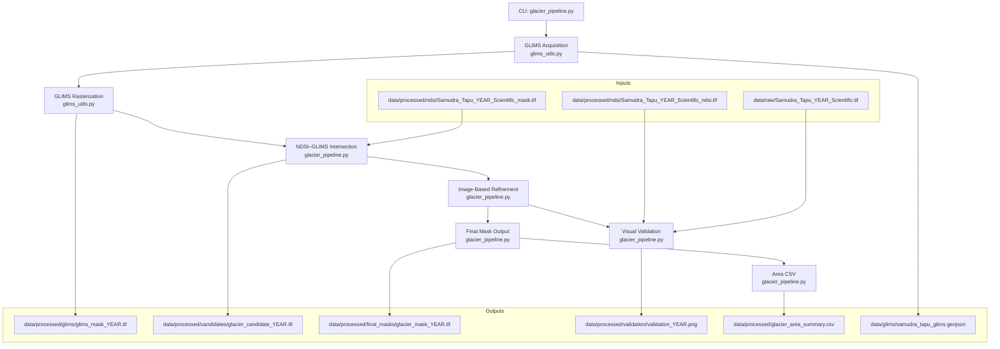

# Design Document: Glacier Segmentation Pipeline

## Overview

The glacier segmentation pipeline takes the existing per-year NDSI candidate masks
(produced by `src/ndsi_mask.py`) and refines them into authoritative glacier extent
masks for Samudra Tapu Glacier (2018–2026). The pipeline is implemented as two Python
modules:

- `src/glims_utils.py` — GLIMS WFS download, filtering, reprojection, and rasterization
- `src/glacier_pipeline.py` — orchestration, refinement, output writing, and CLI

The pipeline runs entirely offline once GLIMS data is cached. All outputs are
georeferenced GeoTIFFs (uint8, DEFLATE, EPSG:32643, 10 m resolution) and
human-readable CSVs / PNGs.

### Design Principles

- **Non-destructive**: existing NDSI outputs and `src/ndsi_mask.py` are never modified.
- **Deterministic**: given the same inputs and parameters, outputs are identical.
- **Minimal dependencies**: only `geopandas`, `shapely`, `scipy`, and `requests` added
  on top of the existing environment.
- **Fail-fast with informative errors**: each stage validates preconditions before
  writing any output.

---

## Architecture



### Stage Sequence (per year)

1. **Acquire** — Download/cache GLIMS polygon (`glims_utils.py`)
2. **Rasterize** — Reproject polygon → NDSI grid → `glims_mask_YEAR.tif`
3. **Intersect** — NDSI_Mask AND GLIMS_Mask → `glacier_candidate_YEAR.tif`
4. **Refine** — Morphological closing + connected-component filter → `glacier_mask_YEAR.tif`
5. **Validate** — 4-panel PNG → `validation_YEAR.png`
6. **Summarize** — Pixel count → area → append to `glacier_area_summary.csv`

---

## Components and Interfaces

### `src/glims_utils.py`

#### `download_glims(glims_dir: Path) -> Path`

Downloads (or uses cached) GLIMS WFS data for Samudra Tapu Glacier.

- Checks for `glims_dir / "samudra_tapu_glims.geojson"`.
- If absent, performs HTTP GET to the GLIMS WFS REST endpoint:
  `https://www.glims.org/geoserver/GLIMS/ows?service=WFS&version=1.0.0&request=GetFeature&typeName=GLIMS:glims_polygons&outputFormat=application/json&CQL_FILTER=glac_id='G077186E32649N'`
- Saves raw GeoJSON response to the cache path.
- Returns the path to the cached file.
- Raises `RuntimeError` with URL and manual-placement instructions on HTTP failure.

#### `load_and_filter_glims(geojson_path: Path) -> gpd.GeoDataFrame`

Loads the cached GeoJSON and filters to Samudra Tapu.

- Filters on `glac_id == 'G077186E32649N'` or `glac_name` containing `'Samudra Tapu'`
  (case-insensitive).
- Raises `ValueError` if the filtered result is empty.
- Returns a single-row `GeoDataFrame`.

#### `rasterize_glims(gdf: gpd.GeoDataFrame, reference_raster: Path, out_path: Path) -> Path`

Reprojects and rasterizes the GLIMS polygon to match a reference raster grid.

- Opens the reference raster with `rasterio` to extract `crs`, `transform`,
  `width`, `height`.
- Reprojects `gdf` from its source CRS (EPSG:4326) to the raster CRS using
  `gdf.to_crs(raster_crs)`.
- Burns the reprojected polygon into a uint8 array using
  `rasterio.features.rasterize`.
- Validates that the resulting mask has at least one pixel equal to 1; raises
  `ValueError` with a CRS-mismatch hint otherwise.
- Writes output as uint8 GeoTIFF with DEFLATE compression, nodata = 0.
- Returns `out_path`.

---

### `src/glacier_pipeline.py`

#### `intersect_masks(ndsi_mask: np.ndarray, glims_mask: np.ndarray) -> np.ndarray`

Produces the Candidate_Mask.

- Returns `255` where `ndsi_mask == 255` (preserve nodata).
- Returns `1` where `ndsi_mask == 1 AND glims_mask == 1`.
- Returns `0` elsewhere.
- Output dtype: uint8.

#### `refine_mask(candidate: np.ndarray, glims_mask: np.ndarray, closing_radius: int = 3, min_area_px: int = 10000) -> np.ndarray`

Applies morphological closing and connected-component filtering.

- Converts `candidate` to a boolean working array (True where == 1, False elsewhere).
- If `closing_radius > 0`:
  - Builds a disk-shaped structuring element of the given radius using
    `scipy.ndimage.generate_binary_structure` or a manual disk kernel.
  - Applies `scipy.ndimage.binary_closing` **masked to the GLIMS boundary**: only
    pixels inside `glims_mask == 1` participate; the result outside is forced to 0.
- Applies `scipy.ndimage.label` to identify connected components.
- Removes components whose pixel count < `min_area_px`.
- Returns uint8 array: 1 = retained glacier pixels, 0 = everything else.
- Logs: number of components found, number removed, final pixel count.

#### `compute_area_km2(mask: np.ndarray, pixel_res_m: float = 10.0) -> float`

`count(mask == 1) * pixel_res_m² / 1e6`

#### `save_raster(array: np.ndarray, reference_profile: dict, out_path: Path, band_desc: str = "", nodata: int = 255) -> None`

Writes a uint8 GeoTIFF with DEFLATE compression, copying CRS/transform from
`reference_profile`, setting `nodata`, and optionally setting a band description.
Creates parent directories as needed.

#### `make_validation_plot(year: int, rgb_path: Path, ndsi_mask: np.ndarray, glims_mask: np.ndarray, candidate: np.ndarray, final: np.ndarray, area_km2: float, out_path: Path) -> None`

Renders and saves a 4-panel validation figure.

- Panel (a): True-colour RGB (bands B4/B3/B2, 2–98 % stretch).
- Panel (b): NDSI_Mask as a binary image with GLIMS boundary contour overlaid in red.
- Panel (c): Candidate_Mask.
- Panel (d): Final_Mask.
- Figure title: `f"Samudra Tapu Glacier {year} — {area_km2:.2f} km²"`.
- Uses `matplotlib.use("Agg")` (non-interactive backend).
- Saves at 150 dpi.

#### `process_year(year: int, ndsi_dir: Path, raw_dir: Path, glims_dir: Path, out_dirs: dict, glims_gdf, closing_radius: int, min_area_px: int) -> dict | None`

Orchestrates all stages for a single year. Returns a stats dict or `None` if
the NDSI input is missing (logs a warning in that case).

#### `main()` / CLI

```
usage: glacier_pipeline.py [-h] [--year YEAR] [--ndsi-dir PATH]
                            [--min-area-km2 FLOAT]
```

- Default: process years 2018–2026.
- `--year`: process a single year.
- `--ndsi-dir`: override default NDSI directory.
- `--min-area-km2`: override default 1.0 km² threshold (converts to pixels internally).
- Calls `download_glims` once before the year loop.
- Writes `glacier_area_summary.csv` after all years complete, sorted ascending.
- Exits non-zero if `processed_count == 0`.

---

## Data Models

### File Layout

```
data/
├── glims/
│   └── samudra_tapu_glims.geojson          # cached GLIMS WFS response
├── raw/
│   └── Samudra_Tapu_YEAR_Scientific.tif    # existing multiband Sentinel-2
└── processed/
    ├── ndsi/
    │   ├── Samudra_Tapu_YEAR_Scientific_mask.tif   # existing (uint8)
    │   └── Samudra_Tapu_YEAR_Scientific_ndsi.tif   # existing (float32)
    ├── glims/
    │   └── glims_mask_YEAR.tif             # NEW uint8, 1=inside, 0=outside
    ├── candidates/
    │   └── glacier_candidate_YEAR.tif      # NEW uint8, 0/1/255
    ├── final_masks/
    │   └── glacier_mask_YEAR.tif           # NEW uint8, 0/1, nodata=255
    ├── validation/
    │   └── validation_YEAR.png             # NEW 4-panel figure
    └── glacier_area_summary.csv            # NEW aggregated area table
```

### Raster Properties (all new outputs)

| Property     | Value                         |
|--------------|-------------------------------|
| Driver       | GTiff                         |
| Dtype        | uint8                         |
| Compression  | DEFLATE                       |
| CRS          | EPSG:32643 (copied from NDSI) |
| Resolution   | 10 m × 10 m                   |
| Nodata       | 255 (or 0 for GLIMS_Mask)     |
| Band count   | 1                             |

### `glacier_area_summary.csv` Schema

| Column                  | Type    | Description                          |
|-------------------------|---------|--------------------------------------|
| `year`                  | int     | Processing year                      |
| `candidate_pixels`      | int     | Pixels == 1 in Candidate_Mask        |
| `candidate_area_km2`    | float   | candidate_pixels × 100 / 1e6        |
| `final_pixels`          | int     | Pixels == 1 in Final_Mask            |
| `final_area_km2`        | float   | final_pixels × 100 / 1e6            |

### In-Memory Arrays

All intermediate raster arrays are `np.ndarray` with `dtype=np.uint8` unless noted.
GLIMS GeoDataFrame is passed between functions as a `gpd.GeoDataFrame` (never re-read
from disk within a single pipeline run).


---

## Correctness Properties

*A property is a characteristic or behavior that should hold true across all valid
executions of a system — essentially, a formal statement about what the system should do.
Properties serve as the bridge between human-readable specifications and
machine-verifiable correctness guarantees.*

### Property 1: Download idempotence

*For any* pre-existing cached GLIMS file, calling `download_glims` a second time should
return the same path without issuing any HTTP request and without modifying the cached
file's contents.

**Validates: Requirements 1.2**

---

### Property 2: GLIMS filter correctness

*For any* GeoDataFrame containing an arbitrary mix of glacier records (random IDs and
names), `load_and_filter_glims` should return only the rows whose `glac_id` equals
`'G077186E32649N'` or whose `glac_name` contains `'Samudra Tapu'` (case-insensitive).
No other rows should be present in the result.

**Validates: Requirements 1.4**

---

### Property 3: Rasterization grid alignment

*For any* valid GLIMS polygon in EPSG:4326 and any reference raster, the output of
`rasterize_glims` should have width, height, affine transform, and CRS that are
identical to those of the reference raster.

**Validates: Requirements 2.1, 2.2**

---

### Property 4: Intersection output value correctness

*For any* pair of uint8 NDSI mask array and GLIMS mask array of the same shape, the
output of `intersect_masks` should satisfy:
- output == 255 wherever ndsi_mask == 255
- output == 1 wherever ndsi_mask == 1 AND glims_mask == 1
- output == 0 in all other cases
and the output should contain only values in {0, 1, 255}.

**Validates: Requirements 3.1, 3.2, 3.4**

---

### Property 5: Component size filtering

*For any* binary mask and any minimum-area threshold `t`, every connected component
in the output of `refine_mask` should have a pixel count ≥ `t`, and no component
with pixel count < `t` from the input should survive in the output.

**Validates: Requirements 4.2**

---

### Property 6: GLIMS boundary containment

*For any* candidate mask and GLIMS mask, the output of `refine_mask` should contain
no pixels equal to 1 at positions where `glims_mask == 0`. The refinement must never
place glacier pixels outside the known glacier boundary.

**Validates: Requirements 4.4, 4.5**

---

### Property 7: Final mask binary value set

*For any* input to `refine_mask`, the output array should contain only values in
{0, 1} — no nodata (255) values should appear in the Final_Mask.

**Validates: Requirements 4.6**

---

### Property 8: Area formula correctness

*For any* uint8 array, `compute_area_km2` should return a value equal to
`np.sum(array == 1) * 100.0 / 1_000_000` (using 10 m × 10 m = 100 m² per pixel).

**Validates: Requirements 7.1**

---

### Property 9: CSV completeness and ordering

*For any* set of successfully processed years (in any processing order), the rows
written to `glacier_area_summary.csv` should contain exactly one row per processed
year, each row should carry the correct pixel counts and area values, and the rows
should appear in strictly ascending year order.

**Validates: Requirements 7.2, 7.3**

---

## Error Handling

| Stage | Failure Condition | Behaviour |
|---|---|---|
| GLIMS download | HTTP error / timeout | `RuntimeError` with URL + manual placement instructions |
| GLIMS filter | Zero polygons match | `ValueError` with glacier name and GLIMS ID |
| Rasterization | Output mask all-zero | `ValueError` with CRS mismatch hint |
| Grid alignment | Width/height/CRS/transform mismatch | `ValueError` identifying the mismatched attribute and values |
| Missing NDSI input | `_mask.tif` absent for a year | Log `WARNING`, skip year, continue loop |
| No years processed | All years skipped or failed | `sys.exit(1)` |

All errors raised within a single year's processing are caught at the
`process_year` level so one bad year does not abort the entire run. Only the
alignment guard and rasterization guard cause immediate aborts (since they
indicate a fundamental data quality problem that would corrupt all outputs).

---

## Testing Strategy

### Dual Testing Approach

Unit tests and property-based tests are complementary and both required:

- **Unit tests** cover specific examples, error conditions, CLI argument parsing,
  file I/O format validation, and integration between components.
- **Property tests** verify universal correctness invariants across randomly generated
  inputs, ensuring the logic holds for all valid data — not just a handful of examples.

### Unit Test Coverage (pytest)

| Test | What it verifies |
|---|---|
| `test_download_creates_file` | HTTP mock → file written, path returned |
| `test_download_error_raises` | Mock HTTP 500 → `RuntimeError` with URL |
| `test_filter_empty_raises` | GDF with no matching rows → `ValueError` |
| `test_rasterize_zero_coverage_raises` | Polygon outside raster extent → `ValueError` |
| `test_alignment_guard` | Mismatched profiles → `ValueError` |
| `test_save_raster_metadata` | Written file has correct nodata/compression/band-desc |
| `test_validation_plot_creates_file` | PNG written, no GUI window opened |
| `test_cli_default_years` | No `--year` arg → all years attempted |
| `test_cli_single_year` | `--year 2021` → only 2021 processed |
| `test_cli_missing_all_years_exits_nonzero` | All NDSI files absent → exit code 1 |
| `test_cli_missing_one_year_continues` | One NDSI file absent → warning logged, others succeed |

### Property-Based Test Configuration (Hypothesis)

Library: **hypothesis** (pure Python, no deep-learning dependency).
Minimum 100 examples per test (`settings(max_examples=100)`).

Each property test is tagged with a comment referencing the design property number.

| Test | Property | Description |
|---|---|---|
| `test_download_idempotence` | Property 1 | Pre-existing file → no HTTP call, content unchanged |
| `test_filter_correctness` | Property 2 | Random GDF → output contains only matching rows |
| `test_rasterize_grid_alignment` | Property 3 | Random polygon + raster profile → output dims match reference |
| `test_intersection_value_correctness` | Property 4 | Random uint8 arrays → output ∈ {0,1,255}, semantics correct |
| `test_component_size_filtering` | Property 5 | Random binary mask + threshold → all retained components ≥ threshold |
| `test_glims_boundary_containment` | Property 6 | Random mask + GLIMS mask → output[glims==0] == 0 |
| `test_final_mask_binary` | Property 7 | Random candidate + GLIMS → output ∈ {0,1} |
| `test_area_formula` | Property 8 | Random uint8 array → area equals pixel_count × 100 / 1e6 |
| `test_csv_completeness_and_order` | Property 9 | Random year set → CSV rows correct and sorted ascending |

Tag format: `# Feature: glacier-segmentation-pipeline, Property N: <property_text>`

Each property-based test runs a minimum of **100 iterations** via
`@settings(max_examples=100)`.
